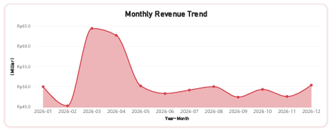
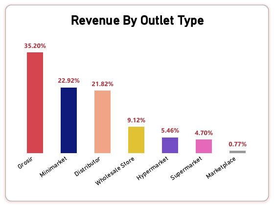
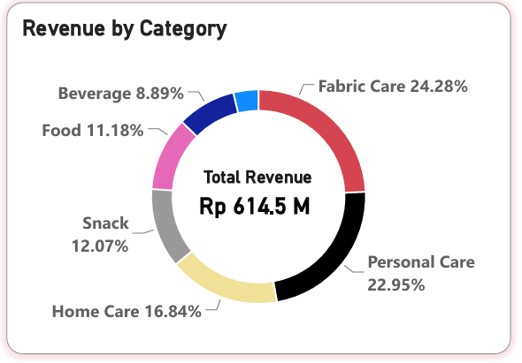
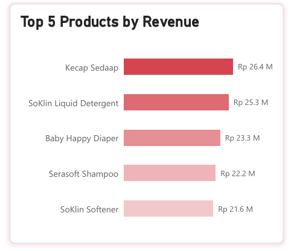
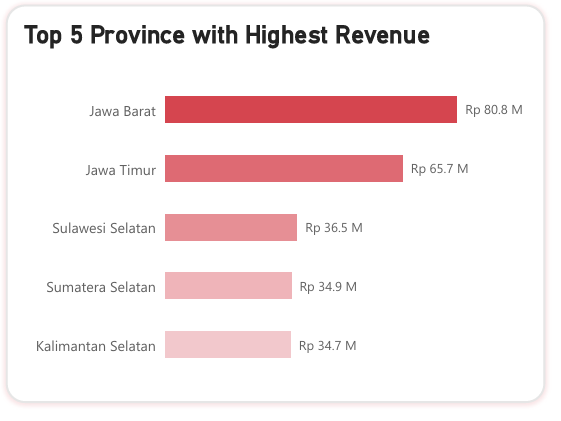

# WINGS-Group Trade Marketing Executive Performance Analysis

## Client Background

WINGS Group is one of Indonesia’s leading FMCG companies with a diverse portfolio of consumer products and an extensive distribution network across multiple sales channels.

The company operates a large-scale commercial ecosystem involving thousands of outlets, hundreds of SKUs, and various trade marketing activities. The Trade Marketing division utilizes business data from sales transactions, product performance, outlet distribution, and promotional activities to monitor performance and optimize business strategies.

This project leverages 500,000+ sales transactions, product data across multiple categories, outlet records from different sales channels, and promotional activity data to provide insights into overall business performance. The analysis aims to help the Trade Marketing team understand sales trends, identify key revenue drivers, and discover opportunities for business improvement through data-driven decision-making.

## Business Problem

The Trade Marketing division at WINGS Group is responsible for monitoring and improving business performance across various products, sales channels, and outlet networks. As the business continues to grow, the company generates a large volume of sales data that can be utilized to evaluate performance and support strategic decision-making.

However, the Trade Marketing Manager faces challenges in transforming available data into actionable insights to understand overall business performance and identify key factors driving revenue growth.

The main business challenges include:

- Limited visibility into overall sales performance
- Difficulty identifying key revenue drivers
- Limited insights into channel performance
- Challenges in evaluating outlet contribution
- Difficulty monitoring sales trends and growth patterns

Therefore, WINGS Group requires a data-driven analysis solution that enables the Trade Marketing Manager to monitor overall business performance, identify key sales drivers, and generate actionable insights to support strategic decision-making.

## Project Objective

As a Data Analyst within the Trade Marketing division, this project focuses on transforming business data into actionable insights to help the Trade Marketing Manager monitor overall performance and support strategic decision-making. The objective of this analysis is to evaluate sales performance, identify key business drivers, and uncover factors that contribute to revenue growth.

Through data analysis and visualization, this project aims to:

- Monitor overall sales performance and identify business growth trends.
- Analyze product and SKU contribution to determine key revenue drivers.
- Evaluate sales channel performance and outlet contribution.
- Provide actionable insights to support data-driven business strategies and performance improvement.

# Dashboard Preview

The Power BI dashboard provides an overview of WINGS Group Trade Marketing performance, including:

- Revenue performance
- Sales trend analysis
- Channel contribution
- Product contribution
- Regional performance

---

# Key Business Insights

## 1. Overall Business Performance

The analysis shows:

- Total Revenue: **Rp614.47 M**
- Total Units Sold: **84.03 JT**
- Total Transactions: **358.1 K**
- Active Outlets: **1.2 K**

**Insight:**

The business performance is supported by a large transaction volume and extensive outlet coverage across multiple sales channels.

---

## 2. Revenue Trend Performance

Monthly revenue analysis shows fluctuations throughout 2026, with the highest performance occurring around March before stabilizing in the following months.

**Insight:**

Sales patterns indicate the importance of demand monitoring, inventory planning, and promotional timing to maintain revenue performance.

---

## 3. Channel Performance

Revenue contribution by outlet type shows:

- Grosir: **35.20%**
- Minimarket: **22.92%**
- Distributor: **21.82%**

**Insight:**

The three major channels contribute nearly 80% of total revenue, highlighting the importance of maintaining strong distribution performance and channel relationships.

---

## 4. Product Performance

Product category contribution:

- Fabric Care: **24.28%**
- Personal Care: **22.95%**
- Home Care: **16.84%**

The top revenue-generating products include:

- Kecap Sedaap: Rp26.4 M
- SoKlin Liquid Detergent: Rp25.3 M
- Baby Happy Diaper: Rp23.3 M
- Serasoft Shampoo: Rp22.2 M
- SoKlin Softener: Rp21.6 M

**Insight:**

Several categories and products act as major revenue drivers, requiring consistent availability and effective promotional strategies.

---

## 5. Regional Performance

Top revenue-contributing provinces:

| Province | Revenue |
|---|---|
| Jawa Barat | Rp80.8 M |
| Jawa Timur | Rp65.7 M |
| Sulawesi Selatan | Rp36.5 M |
| Sumatera Selatan | Rp34.9 M |
| Kalimantan Selatan | Rp34.7 M |

**Insight:**

Revenue concentration in key provinces indicates opportunities for targeted regional strategies and market expansion.

---

# Business Recommendation

| Area | Recommendation |
|---|---|
| Channel Strategy | Maintain strong execution in major channels while improving growth opportunities in smaller channels. |
| Product Strategy | Prioritize availability and promotion of high-performing categories and products. |
| Regional Strategy | Strengthen key markets and explore expansion opportunities in other regions. |
| Sales Planning | Utilize historical sales trends for inventory and promotional planning. |

---

# 5. Skills & Tools Used

## Technical Skills

- Python
  - Data Preparation
  - Data Cleaning
  - Exploratory Data Analysis

- SQL
  - Data Querying
  - Business Analysis

- Power BI
  - Data Visualization
  - Dashboard Development
  - Business Performance Monitoring

## Tools

| Tool | Purpose |
|---|---|
| Python | Data processing and analysis |
| PostgreSQL | Data storage and querying |
| SQL | Business analysis |
| Power BI | Interactive dashboard development |

---

# 6. Next Steps

Future improvements for this project:

- Integrate real-time sales data pipeline.
- Develop customer and outlet segmentation analysis.
- Evaluate promotional effectiveness using additional business metrics.

